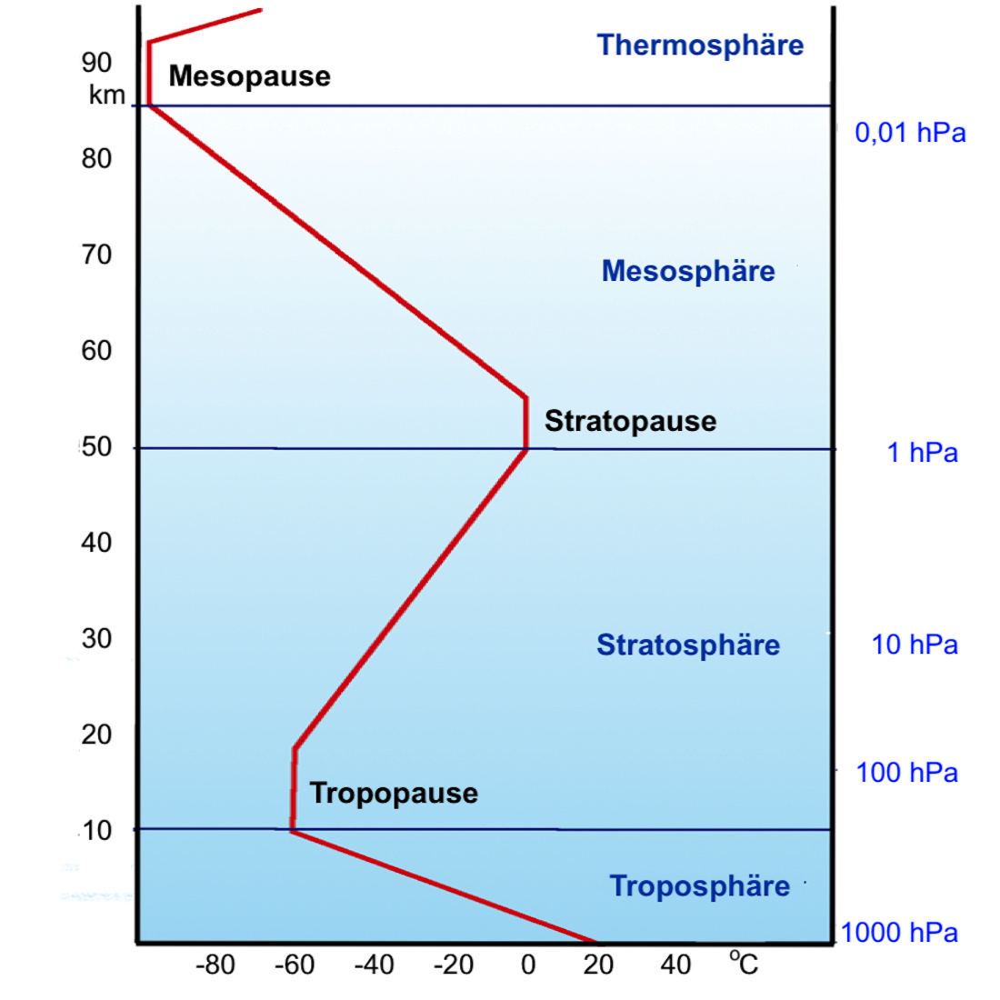

## Zusammensetzung
	- Unsere Atmosphäre besteht aus:
		- Stickstoff (N2): Ca. 78%
		- Sauerstoff (O2): Ca. 21%
		- Argon (Ar): Ca. 0,93%
		- Kohlendioxid (CO2): Ca. 0,04%
		- Spurengase (einschließlich Neon, Helium, Methan, Krypton, Wasserstoff und Xenon): Ca. 0,003% (zusammen)
		-
		- **Stickstoff >> Sauerstoff > Argon > CO2, restliche Gase**
-
- ## [[Strahlung]]
	- {{embed ((6624ee74-b9af-46f1-a96d-70be09c57365)) }}
-
- ## Funktion
	- Die Atmosphäre ist wichtig für uns, da sie die schädliche kurzwelligen UV-C und UV-B Strahlung absorbiert.
	- {{embed [[Auf- und Abbau des Ozons]]}}
-
- ## Temperatur- und Luftdruckverlauf
	- 
	- Die Temperatur wird von der Erde erwärmt, weswegen die Temperatur stetig sinkt bis zum Übergang von Troposphäre in die Stratosphäre
	- In der Stratosphäre wird die Temperatur nochmals erhöht durch den [[Auf- und Abbau des Ozons]]
	- Der Luftdruck wird immer schwächer, je weiter man sich von der Erde entfernt
-
-