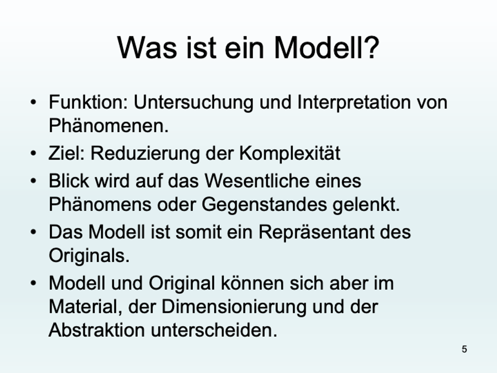

# Stoffe
- Zu den messbaren **Stoffeigenschaften** zählen die Löslichkeit, die Schmelztemperatur, die Siedetemperatur und die elektrische
- Leitfähigkeit. Das Aussehen, der Geruch, der Geschmack und der Klang sind mit den Sinnen wahrnehmbare **Stoffeigenschaften**.
-
- # Reinstoffe
	- Ein Material, das nur aus einer Stoffart besteht wird als Reinstoff bezeichnet.
-
	- ## Elemente
		- auf der PSE
		- Metalle
		- Nichtmetalle
		- Halbmetalle
		- Gase
-
	- ## Verbindungen
		- C_6H_12O_8
		- C0_2
		- H_2O
-
- # Stoffgemische
	- ## Homogen
		- **Homogene Gemische erscheinen von blossem Auge einheitlich**
	- ## Hetrogen
		- **Heterogene Gemische erscheinen bereits von blossem Auge uneinheitlich**
	-
-
- # Modelle
-
	- **Die Vereinfachung eines Ausschnittes der Natur mit dem Zweck der Vorhersage**nennt man ein (naturwissenschaftliches) Modell. Da Modelle nur einen Ausschnitt der Realität beschreiben, haben Modelle Grenzen (der Vorhersagbarkeit). Diese muss man kennen, um die Vorhersagen richtig zu deuten.
	- 
	-