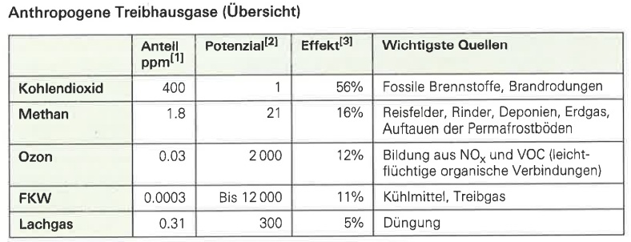

## Funktionsweise
	- Durch die [[Atmosphäre]] gelangt noch die UV-A-Strahlung hindurch. Diese wird von der Erde absorbiert und dann als IR-Strahlung emittiert.
	  :LOGBOOK:
	  CLOCK: [2024-04-21 Sun 13:56:20]--[2024-04-21 Sun 13:56:21] =>  00:00:01
	  CLOCK: [2024-04-21 Sun 13:56:21]--[2024-04-21 Sun 13:56:22] =>  00:00:01
	  CLOCK: [2024-04-21 Sun 13:56:24]--[2024-04-21 Sun 13:56:24] =>  00:00:00
	  :END:
	- Diese IR-Strahlung wird von den [[Treibhausgasen]] in der Atmosphäre absorbiert und wieder als IR-Strahlung emittiert.
-
- ## Anthropogener Treibhauseffekt
	- Menschen fördern den Treibhauseffekt mit den Ressourcen, welchen sie verbrauchen.
	- ### Anteil und Effekt von anthropogenen [[Treibhausgasen]]
		- FKW hat einen viel höheren Einfluss auf den menschengemachten Treibhauseffekt als der
		- 
-